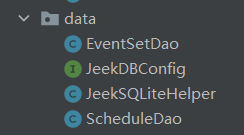
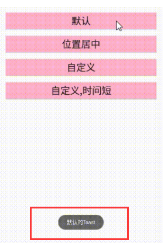
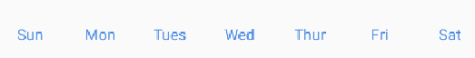

# com.example.common

## com---example---common---bean

关于bean下的文件是胶水代码这件事

保存了事件的信息

### [EventSet](com.example.common.bean/EventSet.md)

**Java语言欠缺属性、事件、多重继承功能。所以，如果要在Java程序中实现一些面向对象编程的常见需求，只能手写大量胶水代码。Java Bean正是编写这套胶水代码的惯用模式或约定**

## com—example—common—data

实现功能为数据的存储



**interface**

### [Serializable](Serializable.md)

这货是用来，持久化的？

### [JeekDBConfig](com.example.common.data/JeekDBConfig.md)

这货存储一些必要的String用到的貌似JeekSQLiteHelper

这娃好像就是一个标准的数据库存储的代码，被玩的那种

话说SQLiteHelper的函数和功能有哪些

### [JeekSQLiteHelper](com.example.common.data/JeekSQLiteHelper.md)

### [EventSetDao](com.example.common.data/EventSetDao.md)

这娃存储事件本身的吗？？？？

#### getAllEventSet

这个函数？？？
getLastEventSetId		removeEventSet	getAllEventSet于是理解了

### [ScheduleDao](com.example.common.data/ ScheduleDao.md)

addSchedule
getLastScheduleId
getScheduleByDate
getTaskHintByMonth
getTaskHintByWeek
removeSchedule
removeScheduleByEventSetId
updateSchedule
getScheduleByEventSetId其实含义清晰通过函数名称
这货联系到com\example\common\bean\Schedule.java

## com.example.common.util

貌似用于各种互换，分辨率的那种

### [DensityUtils](com.example.common.util/DensityUtils.md)

### [DeviceUtils](com.example.common.util/DeviceUtils.md)


### [StringUtils](com.example.common.util/StringUtils.md)


### [ToastUtils](com.example.common.util/ToastUtils.md)

Toast是一个用于提醒的组件，指的是



# com.example.diary

## com.example.diary.month

### OnMonthClickListener

```java
package com.example.diary.month;

public interface OnMonthClickListener {
    void onClickThisMonth(int year, int month, int day);
    void onClickLastMonth(int year, int month, int day);
    void onClickNextMonth(int year, int month, int day);
}
```

### [MonthAdapter](com.example.diary\month\MonthAdapter.md)

**关于PagerAdapter**

并不是很理解PagerAdapter的原理

but，效果大概是生成了每个月的月视图，

### [MonthCalendarView](com.example.diary\month\MonthCalendarView.md)

MonthCalendarView	initAttrs	initMonthAdapter	onClickThisMonth	onClickLastMonth	onClickNextMonth	setOnCalendarClickListener	setTodayToView(跳转到今天)		getMonthViews	getCurrentMonthView对ViewPage的理解，那些函数，在此中被使用的函数有**setCurrentItem**	**invalidate**

### [MonthView](com.example.diary\month\MonthView.md)

效果实现了月视图的绘制

## com.example.diary.schedule

### [AutoMoveAnimation](com.example.diary\schedule\AutoMoveAnimation.md)

### [OnScheduleScrollListener](com.example.diary\schedule\OnScheduleScrollListener.md)
### [ScheduleLayout](com.example.diary\schedule\ScheduleLayout.md)

这货是用来任务的布局的，可以滚动的

### [ScheduleAnimation](com.example.diary\schedule\ScheduleAnimation.md)

翻译过来是，任务动画呈现

### [ScheduleRecyclerView](com.example.diary\schedule\ScheduleRecyclerView.md)

应该是任务完成之后的显示

### ScheduleState

就是一个简单的开关


## com.example.diary.week
功能于com.example.diary.month一致，只是变成了周

## [CalendarUtils](com.example.diary\CalendarUtils.md)

生成的是下标的显示，那些节日

## [LunarCalendarUtils](com.example.diary\LunarCalendarUtils.md)

## [WeekBarView](com.example.diary\WeekBarView.md)



# com.jeek.calendar

## activity
### [AddEventSetActivity.md](D:\code\AndroidStudio\Shedule_app1\代码解析\com.jeek.calendar\activity\AddEventSetActivity.md)


